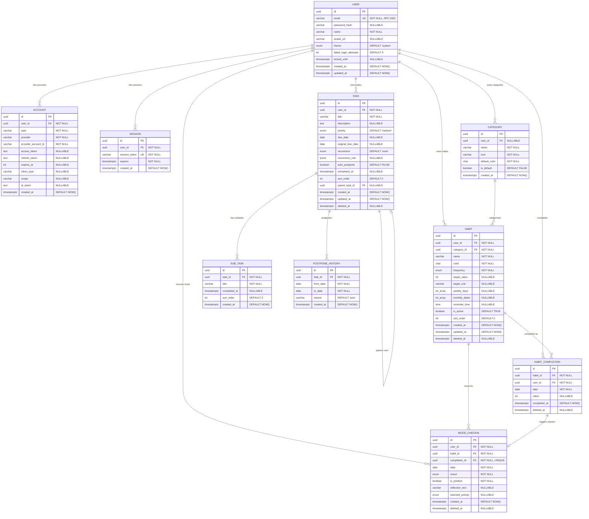

# Entity Relationship Diagram (ERD) Specification

# Vora – Smart Habit Tracking & Task Management Web Application

---

## Document Information

| Field              | Detail                                          |
| ------------------ | ----------------------------------------------- |
| **Document Title** | Vora – ERD Specification                        |
| **Version**        | 1.0                                             |
| **Date**           | 2026-02-10                                      |
| **FSD Reference**  | `prompter/vora-web-app/fsd.md` v1.0             |
| **Author**         | [Author Name]                                   |
| **Status**         | Draft                                           |

---

## 1. Entity Catalog

| Entity Name        | Description                                                          | Type   | Primary Key |
| ------------------ | -------------------------------------------------------------------- | ------ | ----------- |
| User               | Registered application user                                          | Strong | id (UUID)   |
| Account            | OAuth / credential provider link (NextAuth)                          | Weak   | id (UUID)   |
| Session            | Active user session (NextAuth)                                       | Weak   | id (UUID)   |
| Category           | Habit classification (system-default or user-created)                | Strong | id (UUID)   |
| Habit              | Trackable recurring behavior owned by a user                         | Strong | id (UUID)   |
| HabitCompletion    | Record of a single habit completion on a specific date               | Weak   | id (UUID)   |
| MoodCheckin        | Emotional check-in captured upon habit completion                    | Weak   | id (UUID)   |
| Task               | Actionable to-do item owned by a user                                | Strong | id (UUID)   |
| SubTask            | Child item of a Task                                                 | Weak   | id (UUID)   |
| PostponeHistory    | Log of auto-postpone events on a task                                | Weak   | id (UUID)   |

> **10 entities** identified from FSD Sections 4 and 6. `Account` and `Session` are inferred from NextAuth requirement (FR-001/002). `PostponeHistory` is inferred from BR-092.

---

## 2. Entity Details

### 2.1 User

**Description:** A registered person who uses the Vora application. All data is scoped to a user.
**Type:** Strong Entity
**FSD Reference:** FR-001, FR-002, FR-003, FR-004, FR-005; FSD §6.1

| Attribute      | Data Type      | Constraints                    | Description                                    |
| -------------- | -------------- | ------------------------------ | ---------------------------------------------- |
| id             | UUID           | PK, NOT NULL                   | Surrogate primary key                          |
| email          | VARCHAR(255)   | UNIQUE, NOT NULL               | Login email; RFC 5322 format                   |
| password_hash  | VARCHAR(255)   | NULLABLE                       | Bcrypt hash; null for OAuth-only users         |
| name           | VARCHAR(100)   | NOT NULL                       | Display name                                   |
| avatar_url     | VARCHAR(500)   | NULLABLE                       | Profile picture URL                            |
| theme          | ENUM           | NOT NULL, DEFAULT 'system'     | 'light' \| 'dark' \| 'system'                 |
| failed_login_attempts | INTEGER | NOT NULL, DEFAULT 0            | Counter for account lockout (BR-006)           |
| locked_until   | TIMESTAMPTZ    | NULLABLE                       | Lockout expiry timestamp (BR-006)              |
| created_at     | TIMESTAMPTZ    | NOT NULL, DEFAULT NOW()        | Account creation timestamp                     |
| updated_at     | TIMESTAMPTZ    | NOT NULL, DEFAULT NOW()        | Last profile update                            |

**Indexes:**
- `idx_user_email` — UNIQUE index on `email`

**Business Rules:**
- BR-001: Email must be unique across all accounts
- BR-002: Password ≥ 8 chars, ≥ 1 uppercase, ≥ 1 lowercase, ≥ 1 digit
- BR-006: Lock account after 5 failed attempts for 15 minutes
- BR-007: Sessions expire after 30 days of inactivity

---

### 2.2 Account

**Description:** OAuth provider link for a user (NextAuth adapter pattern). Enables Google OAuth and future providers.
**Type:** Weak Entity (dependent on: User)
**FSD Reference:** FR-002 (Google OAuth); NextAuth adapter requirement

| Attribute            | Data Type      | Constraints                    | Description                                    |
| -------------------- | -------------- | ------------------------------ | ---------------------------------------------- |
| id                   | UUID           | PK, NOT NULL                   | Surrogate primary key                          |
| user_id              | UUID           | FK → User.id, NOT NULL         | Owning user                                    |
| type                 | VARCHAR(50)    | NOT NULL                       | 'oauth' \| 'credentials'                      |
| provider             | VARCHAR(50)    | NOT NULL                       | Provider name (e.g., 'google')                 |
| provider_account_id  | VARCHAR(255)   | NOT NULL                       | Provider's unique account ID                   |
| access_token         | TEXT           | NULLABLE                       | OAuth access token                             |
| refresh_token        | TEXT           | NULLABLE                       | OAuth refresh token                            |
| expires_at           | INTEGER        | NULLABLE                       | Token expiry (Unix timestamp)                  |
| token_type           | VARCHAR(50)    | NULLABLE                       | Token type (e.g., 'bearer')                    |
| scope                | VARCHAR(255)   | NULLABLE                       | OAuth scope string                             |
| id_token             | TEXT           | NULLABLE                       | OpenID Connect ID token                        |
| created_at           | TIMESTAMPTZ    | NOT NULL, DEFAULT NOW()        | Record creation timestamp                      |

**Indexes:**
- `idx_account_user_id` — Index on `user_id`
- `idx_account_provider` — UNIQUE composite index on (`provider`, `provider_account_id`)

**Business Rules:**
- BR-004: If Google email matches existing email credential account, accounts shall be linked (same `user_id`)
- BR-005: Google profile name used as initial display name

---

### 2.3 Session

**Description:** Active authentication session for a user (NextAuth adapter pattern).
**Type:** Weak Entity (dependent on: User)
**FSD Reference:** FR-003, FR-005; BR-007, BR-009

| Attribute      | Data Type      | Constraints                    | Description                                    |
| -------------- | -------------- | ------------------------------ | ---------------------------------------------- |
| id             | UUID           | PK, NOT NULL                   | Surrogate primary key                          |
| user_id        | UUID           | FK → User.id, NOT NULL         | Session owner                                  |
| session_token  | VARCHAR(255)   | UNIQUE, NOT NULL               | Unique session token                           |
| expires        | TIMESTAMPTZ    | NOT NULL                       | Session expiry timestamp                       |
| created_at     | TIMESTAMPTZ    | NOT NULL, DEFAULT NOW()        | Session creation timestamp                     |

**Indexes:**
- `idx_session_token` — UNIQUE index on `session_token`
- `idx_session_user_id` — Index on `user_id`

**Business Rules:**
- BR-007: Sessions expire after 30 days of inactivity
- BR-009: Logout invalidates the current session token

---

### 2.4 Category

**Description:** Classification for habits. Includes system-default categories and user-created custom categories.
**Type:** Strong Entity
**FSD Reference:** FR-006, FR-012; FSD §6.1

| Attribute      | Data Type      | Constraints                    | Description                                    |
| -------------- | -------------- | ------------------------------ | ---------------------------------------------- |
| id             | UUID           | PK, NOT NULL                   | Surrogate primary key                          |
| user_id        | UUID           | FK → User.id, NULLABLE         | Owner; NULL = system-default category          |
| name           | VARCHAR(50)    | NOT NULL                       | Category display name                          |
| icon           | VARCHAR(10)    | NOT NULL                       | Emoji icon character                           |
| default_color  | CHAR(7)        | NOT NULL                       | Default hex color (#RRGGBB) for new habits     |
| is_default     | BOOLEAN        | NOT NULL, DEFAULT FALSE        | True = system-provided, cannot be deleted      |
| created_at     | TIMESTAMPTZ    | NOT NULL, DEFAULT NOW()        | Creation timestamp                             |

**Indexes:**
- `idx_category_user_id` — Index on `user_id`
- `idx_category_name_user` — UNIQUE composite on (`name`, `user_id`) WHERE `user_id IS NOT NULL`
- `idx_category_name_default` — UNIQUE partial on (`name`) WHERE `is_default = TRUE`

**Business Rules:**
- BR-041: Sidebar lists all predefined + user-created categories
- BR-042: Each category displays count of active habits
- Category name unique per user (custom) or globally (defaults)

---

### 2.5 Habit

**Description:** A trackable recurring behavior that a user wants to build or maintain.
**Type:** Strong Entity
**FSD Reference:** FR-006, FR-007, FR-008, FR-009, FR-010; FSD §6.1

| Attribute      | Data Type      | Constraints                    | Description                                    |
| -------------- | -------------- | ------------------------------ | ---------------------------------------------- |
| id             | UUID           | PK, NOT NULL                   | Surrogate primary key                          |
| user_id        | UUID           | FK → User.id, NOT NULL         | Owning user                                    |
| category_id    | UUID           | FK → Category.id, NOT NULL     | Classification category                        |
| name           | VARCHAR(100)   | NOT NULL                       | Habit display name                             |
| color          | CHAR(7)        | NOT NULL                       | Hex color from predefined palette (#RRGGBB)    |
| frequency      | ENUM           | NOT NULL                       | 'daily' \| 'weekly' \| 'monthly'              |
| target_value   | INTEGER        | NULLABLE                       | Numeric target (required if frequency = daily) |
| target_unit    | VARCHAR(50)    | NULLABLE                       | Unit label (required if frequency = daily)     |
| weekly_days    | INTEGER[]      | NULLABLE                       | Days of week: 0=Mon..6=Sun (req if weekly)     |
| monthly_dates  | INTEGER[]      | NULLABLE                       | Dates 1–31 (required if frequency = monthly)   |
| reminder_time  | TIME           | NULLABLE                       | Daily notification time (HH:MM)                |
| is_active      | BOOLEAN        | NOT NULL, DEFAULT TRUE         | Soft-active flag                               |
| sort_order     | INTEGER        | NOT NULL, DEFAULT 0            | Display order within category                  |
| created_at     | TIMESTAMPTZ    | NOT NULL, DEFAULT NOW()        | Creation timestamp                             |
| updated_at     | TIMESTAMPTZ    | NOT NULL, DEFAULT NOW()        | Last update timestamp                          |
| deleted_at     | TIMESTAMPTZ    | NULLABLE                       | Soft-delete; NULL = active                     |

**Indexes:**
- `idx_habit_user_id` — Index on `user_id`
- `idx_habit_category_id` — Index on `category_id`
- `idx_habit_user_active` — Filtered index on (`user_id`) WHERE `deleted_at IS NULL`
- `idx_habit_frequency` — Index on (`user_id`, `frequency`)

**Business Rules:**
- BR-013: Name required, max 100 chars
- BR-015: Color from predefined palette only
- BR-017: Daily → `target_value` + `target_unit` required
- BR-018: Weekly → `weekly_days` required, ≥ 1 day
- BR-019: Monthly → `monthly_dates` required, ≥ 1 date
- BR-028: Frequency changes do not delete historical completions
- BR-030: Deletion is soft-delete (`deleted_at` timestamp)

---

### 2.6 HabitCompletion

**Description:** Records a single completion event for a habit on a specific calendar date.
**Type:** Weak Entity (dependent on: Habit, User)
**FSD Reference:** FR-010, FR-011; FSD §6.1

| Attribute      | Data Type      | Constraints                    | Description                                    |
| -------------- | -------------- | ------------------------------ | ---------------------------------------------- |
| id             | UUID           | PK, NOT NULL                   | Surrogate primary key                          |
| habit_id       | UUID           | FK → Habit.id, NOT NULL        | Completed habit                                |
| user_id        | UUID           | FK → User.id, NOT NULL         | User who completed (denormalized for queries)  |
| date           | DATE           | NOT NULL                       | Completion calendar date                       |
| value          | INTEGER        | NULLABLE                       | Achieved value for numeric habits              |
| completed_at   | TIMESTAMPTZ    | NOT NULL, DEFAULT NOW()        | Exact completion timestamp                     |
| deleted_at     | TIMESTAMPTZ    | NULLABLE                       | Soft-delete for undo; NULL = active            |

**Indexes:**
- `idx_completion_unique` — UNIQUE composite on (`habit_id`, `user_id`, `date`) WHERE `deleted_at IS NULL`
- `idx_completion_user_date` — Index on (`user_id`, `date`) for dashboard queries
- `idx_completion_habit_id` — Index on `habit_id`

**Business Rules:**
- BR-036: Stores habitId, userId, date, completedAt
- BR-037: Only one active completion per habit per calendar day (unique constraint)
- BR-038: Uncompleting soft-deletes this record AND the associated MoodCheckin

---

### 2.7 MoodCheckin

**Description:** Captures the user's emotional state at the moment of habit completion via the Smart Check-in modal.
**Type:** Weak Entity (dependent on: HabitCompletion, Habit, User)
**FSD Reference:** FR-015, FR-016, FR-017, FR-018, FR-019; FSD §6.1

| Attribute         | Data Type      | Constraints                    | Description                                    |
| ----------------- | -------------- | ------------------------------ | ---------------------------------------------- |
| id                | UUID           | PK, NOT NULL                   | Surrogate primary key                          |
| user_id           | UUID           | FK → User.id, NOT NULL         | Check-in user                                  |
| habit_id          | UUID           | FK → Habit.id, NOT NULL        | Associated habit                               |
| completion_id     | UUID           | FK → HabitCompletion.id, NOT NULL | Associated completion record                |
| date              | DATE           | NOT NULL                       | Check-in calendar date                         |
| mood              | ENUM           | NOT NULL                       | 'happy'\|'proud'\|'worried'\|'annoyed'\|'sad'\|'angry' |
| is_positive       | BOOLEAN        | NOT NULL                       | Derived: true for happy/proud, false otherwise |
| reflection_text   | VARCHAR(500)   | NULLABLE                       | Optional reflection (negative path only)       |
| selected_activity | ENUM           | NULLABLE                       | 'short_break'\|'deep_breathing'\|'calming_music'\|'talk_to_someone'\|'go_for_walk' |
| created_at        | TIMESTAMPTZ    | NOT NULL, DEFAULT NOW()        | Creation timestamp                             |
| deleted_at        | TIMESTAMPTZ    | NULLABLE                       | Soft-delete for undo; NULL = active            |

**Indexes:**
- `idx_mood_unique` — UNIQUE composite on (`habit_id`, `user_id`, `date`) WHERE `deleted_at IS NULL`
- `idx_mood_completion_id` — UNIQUE index on `completion_id` (1:1 relationship)
- `idx_mood_user_date` — Index on (`user_id`, `date`)
- `idx_mood_positive` — Index on (`user_id`, `is_positive`) for analytics filtering

**Business Rules:**
- BR-059: Six mood options with emoji representation
- BR-060: Exactly one mood per check-in
- BR-061: Positive = {happy, proud}; Negative = {worried, annoyed, sad, angry}
- BR-074: Stores mood, isPositive, reflectionText, selectedActivity
- BR-075: Duplicate check-in for same habit/day overwrites (upsert)

---

### 2.8 Task

**Description:** An actionable to-do item with optional due date, priority, recurrence, and auto-postpone.
**Type:** Strong Entity
**FSD Reference:** FR-020, FR-021, FR-022, FR-023, FR-024, FR-025, FR-026; FSD §6.1

| Attribute        | Data Type      | Constraints                    | Description                                    |
| ---------------- | -------------- | ------------------------------ | ---------------------------------------------- |
| id               | UUID           | PK, NOT NULL                   | Surrogate primary key                          |
| user_id          | UUID           | FK → User.id, NOT NULL         | Task owner                                     |
| title            | VARCHAR(200)   | NOT NULL                       | Task title                                     |
| description      | TEXT           | NULLABLE                       | Rich text description (HTML); max 2000 chars   |
| priority         | ENUM           | NOT NULL, DEFAULT 'medium'     | 'high' \| 'medium' \| 'low'                   |
| due_date         | DATE           | NULLABLE                       | Due date                                       |
| original_due_date| DATE           | NULLABLE                       | Preserved on first auto-postpone               |
| recurrence       | ENUM           | NOT NULL, DEFAULT 'none'       | 'none'\|'daily'\|'weekly'\|'monthly'\|'custom' |
| recurrence_rule  | JSONB          | NULLABLE                       | Custom recurrence config (if recurrence ≠ none)|
| auto_postpone    | BOOLEAN        | NOT NULL, DEFAULT FALSE        | Auto-postpone toggle                           |
| completed_at     | TIMESTAMPTZ    | NULLABLE                       | Completion timestamp; NULL = incomplete        |
| sort_order       | INTEGER        | NOT NULL, DEFAULT 0            | Display order within task list                 |
| parent_task_id   | UUID           | FK → Task.id, NULLABLE         | For recurring task lineage tracking            |
| created_at       | TIMESTAMPTZ    | NOT NULL, DEFAULT NOW()        | Creation timestamp                             |
| updated_at       | TIMESTAMPTZ    | NOT NULL, DEFAULT NOW()        | Last update timestamp                          |
| deleted_at       | TIMESTAMPTZ    | NULLABLE                       | Soft-delete; NULL = active                     |

**Indexes:**
- `idx_task_user_id` — Index on `user_id`
- `idx_task_user_active` — Filtered index on (`user_id`, `due_date`) WHERE `deleted_at IS NULL`
- `idx_task_due_date` — Index on (`user_id`, `due_date`) WHERE `completed_at IS NULL AND deleted_at IS NULL` (for overdue/today/upcoming queries)
- `idx_task_priority` — Index on (`user_id`, `priority`)
- `idx_task_parent` — Index on `parent_task_id`

**Business Rules:**
- BR-077: Title required, max 200 chars
- BR-080: Due date ≥ today on creation
- BR-086: All sub-tasks complete → parent auto-completes
- BR-089: Auto-postpone moves overdue due_date to today
- BR-091: `original_due_date` preserved on first postpone
- BR-093: Auto-postpone skips completed tasks
- BR-097: Completing recurring task creates new instance
- BR-102: Deletion is soft-delete

---

### 2.9 SubTask

**Description:** A child item of a Task, representing a smaller actionable step.
**Type:** Weak Entity (dependent on: Task)
**FSD Reference:** FR-020, FR-021; FSD §6.1

| Attribute      | Data Type      | Constraints                    | Description                                    |
| -------------- | -------------- | ------------------------------ | ---------------------------------------------- |
| id             | UUID           | PK, NOT NULL                   | Surrogate primary key                          |
| task_id        | UUID           | FK → Task.id, NOT NULL         | Parent task (CASCADE DELETE on soft-delete)     |
| title          | VARCHAR(200)   | NOT NULL                       | Sub-task title                                 |
| completed_at   | TIMESTAMPTZ    | NULLABLE                       | Completion timestamp; NULL = incomplete        |
| sort_order     | INTEGER        | NOT NULL, DEFAULT 0            | Display order within parent task               |
| created_at     | TIMESTAMPTZ    | NOT NULL, DEFAULT NOW()        | Creation timestamp                             |

**Indexes:**
- `idx_subtask_task_id` — Index on `task_id`

**Business Rules:**
- BR-079: Each sub-task has title (max 200 chars) + completion checkbox
- BR-085: Sub-tasks completed independently of parent
- BR-086: When ALL sub-tasks completed → parent task auto-completes
- BR-087: Completing parent does NOT auto-complete sub-tasks

---

### 2.10 PostponeHistory

**Description:** Audit log tracking each auto-postpone event on a task.
**Type:** Weak Entity (dependent on: Task)
**FSD Reference:** FR-022; BR-092

| Attribute      | Data Type      | Constraints                    | Description                                    |
| -------------- | -------------- | ------------------------------ | ---------------------------------------------- |
| id             | UUID           | PK, NOT NULL                   | Surrogate primary key                          |
| task_id        | UUID           | FK → Task.id, NOT NULL         | Postponed task                                 |
| from_date      | DATE           | NOT NULL                       | Previous due date                              |
| to_date        | DATE           | NOT NULL                       | New due date (typically today)                 |
| reason         | VARCHAR(50)    | NOT NULL, DEFAULT 'auto'       | Postpone reason ('auto' for system-triggered)  |
| created_at     | TIMESTAMPTZ    | NOT NULL, DEFAULT NOW()        | When the postponement occurred                 |

**Indexes:**
- `idx_postpone_task_id` — Index on `task_id`

**Business Rules:**
- BR-092: A postpone history log shall track each postponement with date and reason

---

## 3. Relationship Specifications

| #  | Relationship         | Entity A          | Entity B          | Cardinality | A Participation | B Participation | Description                                                    |
| -- | -------------------- | ----------------- | ----------------- | ----------- | --------------- | --------------- | -------------------------------------------------------------- |
| R1 | has accounts         | User              | Account           | 1:N         | Total           | Total           | User can have multiple OAuth accounts (Google, future providers)|
| R2 | has sessions         | User              | Session           | 1:N         | Total           | Total           | User can have multiple concurrent sessions                     |
| R3 | owns categories      | User              | Category          | 1:N         | Partial         | Partial         | User can create custom categories; defaults have no user       |
| R4 | owns habits          | User              | Habit             | 1:N         | Total           | Total           | Every habit belongs to exactly one user                        |
| R5 | categorized as       | Habit             | Category          | N:1         | Total           | Partial         | Every habit belongs to one category                            |
| R6 | completes            | User              | HabitCompletion   | 1:N         | Total           | Total           | User creates completion records                                |
| R7 | completion of        | Habit             | HabitCompletion   | 1:N         | Partial         | Total           | Each completion linked to one habit                            |
| R8 | triggers checkin     | HabitCompletion   | MoodCheckin       | 1:0..1      | Partial         | Total           | A completion may optionally have one mood check-in             |
| R9 | mood for habit       | Habit             | MoodCheckin       | 1:N         | Partial         | Total           | Mood check-ins are scoped per habit                            |
| R10| mood by user         | User              | MoodCheckin       | 1:N         | Total           | Total           | Each check-in belongs to one user                              |
| R11| owns tasks           | User              | Task              | 1:N         | Total           | Total           | Every task belongs to exactly one user                         |
| R12| has subtasks         | Task              | SubTask           | 1:N         | Partial         | Total           | A task can have zero or more sub-tasks                         |
| R13| spawns next          | Task              | Task              | 1:0..1      | Partial         | Partial         | Recurring task self-ref: parent → next occurrence              |
| R14| has postpone history | Task              | PostponeHistory   | 1:N         | Partial         | Total           | Each postpone event is logged for audit                        |

---

## 4. ERD Notation (Mermaid)

---

## 5. Design Decisions & Notes

### 5.1 Key Assumptions

| # | Assumption | Rationale |
|---|------------|-----------|
| 1 | **NextAuth adapter entities** (Account, Session) are included even though FSD §6.1 doesn't explicitly list them | NextAuth.js with Prisma adapter requires these tables for OAuth flow to function. Without them, FR-002 (Google OAuth) cannot work. |
| 2 | **PostponeHistory** entity inferred from BR-092 | FSD mentions "a postpone history log shall track each postponement" — this requires a dedicated table rather than an audit trigger. |
| 3 | **`user_id` denormalized on HabitCompletion and MoodCheckin** | Although derivable via Habit → User, having `user_id` directly enables efficient analytics queries (FR-027–030) without JOINs. |
| 4 | **`parent_task_id` self-referencing FK on Task** | Enables recurring task lineage tracking (BR-097: completing a recurring task creates a new instance). Not specified in FSD §6.1 but required for FR-024. |
| 5 | **`failed_login_attempts` and `locked_until` on User** | BR-006 requires account lockout after 5 failed attempts. These fields are not in FSD §6.1 but are necessary for FR-003 implementation. |

### 5.2 Alternative Modeling Options Considered

| Option | Considered | Decision | Rationale |
|--------|------------|----------|-----------|
| Separate `HabitSchedule` table for weekly/monthly days | Yes | **Rejected** | Array columns (`weekly_days`, `monthly_dates`) on Habit are simpler for MVP 1. A normalized schedule table would be better for complex custom frequencies (post-MVP). |
| Separate `Color` palette entity | Yes | **Rejected** | 8–12 predefined colors are better managed as application constants. A DB entity adds overhead for rarely-changing data. |
| Shared `AuditLog` table instead of `PostponeHistory` | Yes | **Rejected** | A generic audit log is harder to query; PostponeHistory is a focused, small table with clear purpose. |
| `VerificationToken` entity for email verification | Yes | **Deferred** | NextAuth supports email verification but the FSD doesn't explicitly require email verification in MVP 1. Can be added later. |
| Separate `UserPreference` entity | Yes | **Rejected** | Currently only `theme` preference exists. A separate table for one field is over-engineering. Add when preferences grow. |
| Junction table for M:N Habit-to-Category | No | **Not applicable** | FSD specifies each habit belongs to exactly one category (N:1), not M:N. |

### 5.3 Normalization Analysis

| Entity           | Normal Form | Notes                                                                                          |
| ---------------- | ----------- | ---------------------------------------------------------------------------------------------- |
| User             | 3NF ✅       | All attributes functionally depend on `id`                                                    |
| Account          | 3NF ✅       | Standard NextAuth adapter schema                                                              |
| Session          | 3NF ✅       | Standard NextAuth adapter schema                                                              |
| Category         | 3NF ✅       | `user_id` nullable (system vs custom) — no transitive dependency                              |
| Habit            | 3NF ✅       | `weekly_days` and `monthly_dates` are multi-valued in array form — intentional denormalization for simplicity; acceptable for MVP |
| HabitCompletion  | 3NF ✅       | `user_id` is denormalized (derivable from `habit_id` → Habit → `user_id`) — intentional for query performance |
| MoodCheckin      | 3NF ✅       | `is_positive` is derived from `mood` — intentional denormalization for filtering performance   |
| Task             | 3NF ✅       | `original_due_date` only used when auto-postpone fires — no transitive dependency             |
| SubTask          | 3NF ✅       | Clear functional dependency on `task_id`                                                      |
| PostponeHistory  | 3NF ✅       | Pure audit/log entity; append-only                                                            |

**Intentional Denormalizations (with justification):**

1. **`user_id` on HabitCompletion:** Avoids JOIN through Habit for all analytics queries (FR-027–030). Analytics queries run frequently; the 8-byte UUID storage cost per row is negligible.
2. **`is_positive` on MoodCheckin:** Derived boolean avoids CASE/IN checks in every mood analytics query. Updated on write (computed column or application logic).
3. **`weekly_days` / `monthly_dates` as arrays on Habit:** Normalizing to a separate table (HabitSchedule) would require a JOIN for every dashboard query. With max 7 or 31 values, arrays are a pragmatic choice.

### 5.4 Cascade & Referential Integrity Rules

| Parent Entity      | Child Entity       | ON DELETE          | ON UPDATE    | Rationale                                              |
| ------------------ | ------------------ | ------------------ | ------------ | ------------------------------------------------------ |
| User               | Account            | CASCADE            | CASCADE      | Deleting user removes all OAuth links                  |
| User               | Session            | CASCADE            | CASCADE      | Deleting user invalidates all sessions                 |
| User               | Category           | SET NULL           | CASCADE      | User-created categories become orphaned but safe       |
| User               | Habit              | RESTRICT           | CASCADE      | Prevent user deletion if habits exist (soft-delete first)|
| User               | Task               | RESTRICT           | CASCADE      | Prevent user deletion if tasks exist                   |
| User               | HabitCompletion    | RESTRICT           | CASCADE      | Prevent user deletion if completions exist             |
| User               | MoodCheckin        | RESTRICT           | CASCADE      | Prevent user deletion if mood data exists              |
| Category           | Habit              | RESTRICT           | CASCADE      | Cannot delete category with active habits              |
| Habit              | HabitCompletion    | RESTRICT           | CASCADE      | Cannot hard-delete habit with completions              |
| Habit              | MoodCheckin        | RESTRICT           | CASCADE      | Cannot hard-delete habit with mood data                |
| HabitCompletion    | MoodCheckin        | CASCADE            | CASCADE      | Deleting completion also deletes mood check-in         |
| Task               | SubTask            | CASCADE            | CASCADE      | Deleting task deletes all sub-tasks                    |
| Task               | PostponeHistory    | CASCADE            | CASCADE      | Deleting task deletes postpone history                 |
| Task               | Task (self-ref)    | SET NULL           | CASCADE      | Deleting parent doesn't cascade to child tasks         |

### 5.5 Recommendations for Implementation

1. **Prisma Schema:** All entities should be modeled in a single `schema.prisma` file using `@relation`, `@unique`, `@@unique`, and `@@index` decorators.
2. **Enum Strategy:** Use PostgreSQL native enums for `frequency`, `mood`, `priority`, `recurrence`, `theme`, `selected_activity` for type safety and storage efficiency.
3. **Soft-Delete Middleware:** Implement Prisma middleware or a global query extension that auto-appends `WHERE deleted_at IS NULL` to all queries on entities with soft-delete.
4. **Seed Data:** Create a seed script to populate default categories (e.g., Health 🏃, Education 📚, Work 💼, Social 👥, Finance 💰, Hobby 🎨, Mindfulness 🧘, Other ✨).
5. **Migration Strategy:** Use `prisma migrate dev` for development and `prisma migrate deploy` for production. Each entity change should be a separate migration.
6. **Timezone Handling:** All `TIMESTAMPTZ` columns store UTC. Client converts to/from local timezone. `DATE` columns (completion date, due date) store the calendar date in the user's local timezone.

---

## 6. Verification Checklist

- [x] Every feature in the FSD can be supported by the data model
- [x] All user roles mentioned have corresponding entities (User with theme preference)
- [x] Workflow states are captured (HabitCompletion for habit state, Task.completed_at for task state, MoodCheckin for check-in state)
- [x] Reporting requirements can be satisfied by the structure (analytics queries on HabitCompletion, MoodCheckin)
- [x] No orphan entities exist (every entity has at least one relationship)
- [x] Soft-delete pattern applied to: Habit, HabitCompletion, MoodCheckin, Task (per FSD BR-030, BR-038, BR-102)
- [x] Audit fields (created_at, updated_at) present on transactional entities
- [x] All M:N relationships resolved — none found (all are 1:N or 1:1)
- [x] Authentication entities (Account, Session) support NextAuth adapter
- [x] Self-referencing relationship on Task supports recurring task lineage

---

## Appendix: Revision History

| Version | Date       | Author        | Changes                        |
| ------- | ---------- | ------------- | ------------------------------ |
| 1.0     | 2026-02-10 | [Author Name] | Initial ERD from FSD v1.0      |

---

*Document generated on 2026-02-10. This ERD is derived from FSD v1.0 and aligns with PRD v2.0.*
